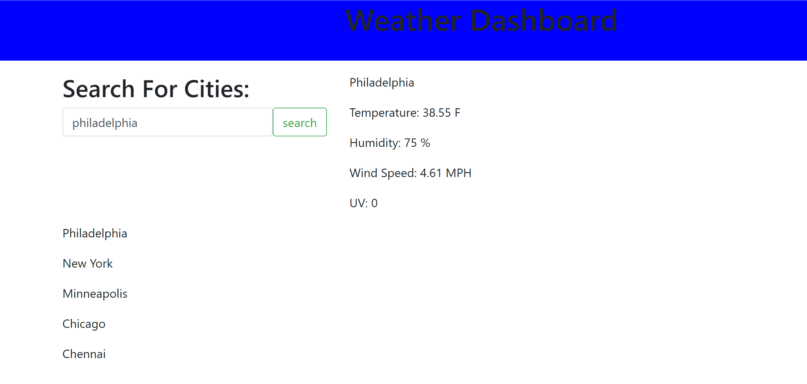

# WeatherDashbord2021
Weather App That Brings Important Weather Info

STEPS FOR BUILDING THE HTML FILE
1. I added the h1 and div tags for the header
2. I created a search button with the search input field
3. I added rows and columns and put the search field inside of it.
4. I created Ptags and gave them all ID's
5. I added a history ID's to the five lower ptags to capture the users city history

STEPS FOR BUILDING THE STYLE.CSS FILE
1. I added a class to the h1 tag to center the text and created a div to color the head background to blue

STEPS FOR BUILDING THE JS FILE
1. I added the link to attach the Openweather API with the a.jax code
2. I created a click event function to connect the search button with the input values
3. I added the code to grab the current city, temperature, humidity, and wind speed information
4. I set up the local storage to store the user history for the last five cities that were searched and displayed them under the search input
5. I added the UV information

https://github.com/JosephRhines/WeatherDashbord2021 
https://josephrhines.github.io/WeatherDashbord2021/
